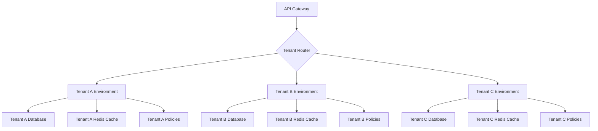

# Multi-Tenancy

KoreShield provides enterprise-grade multi-tenancy with complete tenant isolation, per-tenant configuration, resource quotas, and dedicated analytics.

## Overview

Multi-tenancy in KoreShield allows you to:

- **Isolate** tenants with secure data separation
- **Configure** per-tenant policies and settings
- **Monitor** usage and performance per tenant
- **Bill** based on tenant consumption
- **Scale** to thousands of tenants

---

## Tenant Architecture



### Isolation Levels

KoreShield supports three isolation levels:

#### Shared Database (Default)
```yaml
multi_tenancy:
  isolation_level: shared_database
```

- Single database with tenant_id column
- Lowest cost
- Good for most use cases
- Tenant data logically separated

**Pros:**
- Easy to manage
- Lower infrastructure cost
- Simpler backups

**Cons:**
- Potential noisy neighbor issues
- Shared resource pool

#### Separate Schemas
```yaml
multi_tenancy:
  isolation_level: separate_schemas
```

- Each tenant gets own database schema
- Better isolation
- Moderate cost increase
- Good for compliance requirements

**Pros:**
- Better performance isolation
- Easier to identify tenant data
- Per-tenant backups

**Cons:**
- More complex schema management
- Higher overhead

#### Dedicated Databases
```yaml
multi_tenancy:
  isolation_level: dedicated_databases
```

- Each tenant gets own database instance
- Highest isolation
- Highest cost
- Required for strict compliance

**Pros:**
- Complete isolation
- Dedicated resources
- Easy to migrate tenant data
- Custom database configuration per tenant

**Cons:**
- Higher cost
- More complex management
- Connection pool management

---

## Tenant Provisioning

### Creating Tenants

#### Via API
```python
from koreshield_sdk import KoreShieldClient

client = KoreShieldClient(api_key="admin-api-key")

# Create new tenant
tenant = client.create_tenant(
    name="Acme Corporation",
    slug="acme-corp",
    tier="enterprise",
    isolation_level="separate_schemas",
    config={
        "sensitivity": "high",
        "max_requests_per_minute": 10000,
        "data_retention_days": 90
    }
)

print(f"Tenant ID: {tenant['id']}")
print(f"API Key: {tenant['api_key']}")
```

#### Via CLI
```bash
# Create tenant
koreshield tenant create \
  --name "Acme Corporation" \
  --slug "acme-corp" \
  --tier "enterprise" \
  --isolation "separate_schemas"

# Output:
# Tenant created successfully
# Tenant ID: tenant_abc123
# API Key: ks_prod_xxxxxxxxxxxx
```

#### Via Configuration File
```yaml
tenants:
  - id: tenant_acme
    name: "Acme Corporation"
    slug: "acme-corp"
    tier: "enterprise"
    status: "active"
    created_at: "2026-01-15T10:00:00Z"
    config:
      isolation_level: "separate_schemas"
      sensitivity: "high"
      max_requests_per_minute: 10000
      data_retention_days: 90
```

### Tenant Tiers

Define pricing/feature tiers:

```yaml
tenant_tiers:
  - id: free
    name: "Free Tier"
    limits:
      max_requests_per_month: 10000
      max_users: 3
      max_api_keys: 2
      data_retention_days: 7
      support: "community"
    features:
      - basic_detection
      - email_alerts
    
  - id: startup
    name: "Startup Tier"
    price: "$299/month"
    limits:
      max_requests_per_month: 1000000
      max_users: 10
      max_api_keys: 10
      data_retention_days: 30
      support: "email"
    features:
      - advanced_detection
      - custom_rules
      - slack_alerts
      - api_access
    
  - id: growth
    name: "Growth Tier"
    price: "$2,000/month"
    limits:
      max_requests_per_month: 10000000
      max_users: 50
      max_api_keys: 50
      data_retention_days: 90
      support: "priority"
    features:
      - all_startup_features
      - dedicated_support
      - sla_99_9
      - custom_integrations
    
  - id: enterprise
    name: "Enterprise Tier"
    price: "Custom"
    limits:
      max_requests_per_month: "unlimited"
      max_users: "unlimited"
      max_api_keys: "unlimited"
      data_retention_days: 365
      support: "dedicated"
    features:
      - all_growth_features
      - dedicated_database
      - custom_deployment
      - sla_99_99
      - compliance_support
```

---

## Per-Tenant Configuration

### Sensitivity Levels

Each tenant can have custom sensitivity:

```yaml
tenants:
  - id: tenant_healthcare
    name: "HealthCare Inc"
    sensitivity: high  # HIPAA compliance
    
  - id: tenant_marketing
    name: "Marketing Agency"
    sensitivity: low   # Allow creative freedom
    
  - id: tenant_finance
    name: "Finance Corp"
    sensitivity: high  # PCI-DSS compliance
```

### Custom Policies

Per-tenant detection policies:

```yaml
tenants:
  - id: tenant_custom
    name: "Custom Rules Corp"
    policies:
      - name: "Block Crypto Addresses"
        pattern: "\\b[13][a-km-zA-HJ-NP-Z1-9]{25,34}\\b"
        action: block
        
      - name: "Warn on Internal Keywords"
        pattern: ".*(confidential|internal).*"
        action: warn
        
      - name: "Custom Threshold"
        condition: "confidence > 0.75"
        action: block
```

### Allowlists & Blocklists

Per-tenant lists:

```yaml
tenants:
  - id: tenant_specialized
    allowlist:
      - pattern: "test prompt injection"
        reason: "QA testing pattern"
      - pattern: ".*admin.*"
        reason: "Admin commands for authorized users"
    
    blocklist:
      - pattern: ".*DROP TABLE.*"
        reason: "SQL injection"
      - pattern: "bitcoin address:"
        reason: "Cryptocurrency spam"
```

### Provider Configuration

Each tenant can use different LLM providers:

```yaml
tenants:
  - id: tenant_openai
    name: "OpenAI User"
    providers:
      - type: openai
        api_key: "sk-proj-..."
        models: ["gpt-4", "gpt-3.5-turbo"]
        default: true
    
  - id: tenant_anthropic
    name: "Anthropic User"
    providers:
      - type: anthropic
        api_key: "sk-ant-..."
        models: ["claude-3-opus", "claude-3-sonnet"]
        default: true
    
  - id: tenant_multi
    name: "Multi-Provider User"
    providers:
      - type: openai
        api_key: "sk-proj-..."
        default: true
      - type: anthropic
        api_key: "sk-ant-..."
      - type: deepseek
        api_key: "sk-..."
```

---

## Resource Quotas & Limits

### Request Limits

Per-tenant request limits:

```yaml
tenants:
  - id: tenant_startup
    quotas:
      requests_per_minute: 1000
      requests_per_hour: 50000
      requests_per_day: 1000000
      requests_per_month: 10000000
      
      # Burst allowance
      burst_size: 5000
      burst_duration_seconds: 60
```

### Storage Limits

Per-tenant storage quotas:

```yaml
tenants:
  - id: tenant_storage
    quotas:
      max_log_storage_gb: 100
      max_attachment_size_mb: 50
      max_custom_rules: 100
      data_retention_days: 90
```

### Compute Limits

Resource allocation:

```yaml
tenants:
  - id: tenant_compute
    quotas:
      max_concurrent_requests: 500
      max_detection_latency_ms: 100
      cpu_shares: 1024
      memory_limit_mb: 2048
```

### Enforcement

When limits are exceeded:

```yaml
quota_enforcement:
  action: throttle  # throttle, block, warn
  response:
    status_code: 429
    message: "Rate limit exceeded. Upgrade your plan for higher limits."
    retry_after_seconds: 60
  notification:
    email: true
    slack: false
```

---

## Tenant Isolation

### Data Isolation

#### Query-Level Isolation
```sql
-- All queries automatically include tenant_id filter
SELECT * FROM attacks WHERE tenant_id = 'tenant_abc123';

-- Enforced at ORM level
attacks = Attack.query.filter_by(tenant_id=current_tenant_id).all()
```

#### Application-Level Checks
```python
from koreshield.middleware import require_tenant

@require_tenant
def get_attacks(tenant_id: str):
    # Automatically validated - can only access own tenant
    attacks = Attack.query.filter_by(tenant_id=tenant_id).all()
    return attacks
```

### Network Isolation

For dedicated database tenants:

```yaml
tenants:
  - id: tenant_isolated
    network:
      vpc_id: "vpc-abc123"
      subnet_id: "subnet-xyz789"
      security_group_id: "sg-secure123"
      private_endpoint: true
```

### Encryption

Per-tenant encryption keys:

```yaml
tenants:
  - id: tenant_encrypted
    encryption:
      enabled: true
      key_management: "customer_managed"  # or "koreshield_managed"
      kms_key_id: "arn:aws:kms:us-east-1:123456789:key/..."
      encrypt_at_rest: true
      encrypt_in_transit: true
```

---

## Tenant Management

### User Management

Add users to tenants:

```python
# Add user to tenant
client.add_user_to_tenant(
    tenant_id="tenant_abc123",
    email="user@company.com",
    role="developer",
    permissions=["api:read", "api:write"]
)

# List tenant users
users = client.get_tenant_users(tenant_id="tenant_abc123")
for user in users:
    print(f"{user['email']} - {user['role']}")

# Remove user from tenant
client.remove_user_from_tenant(
    tenant_id="tenant_abc123",
    user_id="user_456"
)
```

### API Key Management

Per-tenant API keys:

```python
# Create API key for tenant
api_key = client.create_api_key(
    tenant_id="tenant_abc123",
    name="Production API Key",
    scopes=["detect", "logs:read"],
    expires_at="2027-01-01T00:00:00Z"
)

# Rotate API key
new_key = client.rotate_api_key(
    key_id="key_old_123",
    tenant_id="tenant_abc123"
)

# Revoke API key
client.revoke_api_key(key_id="key_old_123")
```

### Tenant Status

Manage tenant lifecycle:

```python
# Suspend tenant (billing issue, abuse, etc.)
client.suspend_tenant(
    tenant_id="tenant_abc123",
    reason="Payment overdue"
)

# Reactivate tenant
client.reactivate_tenant(tenant_id="tenant_abc123")

# Delete tenant (soft delete with 30-day grace period)
client.delete_tenant(
    tenant_id="tenant_abc123",
    reason="Customer requested deletion"
)

# Permanently delete tenant data
client.purge_tenant_data(tenant_id="tenant_abc123")
```

---

## Tenant Analytics

### Per-Tenant Metrics

```python
# Get tenant usage stats
stats = client.get_tenant_stats(
    tenant_id="tenant_abc123",
    start_date="2026-01-01",
    end_date="2026-01-31"
)

print(f"Total Requests: {stats['total_requests']}")
print(f"Threats Blocked: {stats['threats_blocked']}")
print(f"Block Rate: {stats['block_rate']:.2%}")
print(f"Avg Latency: {stats['avg_latency_ms']}ms")
print(f"Cost: ${stats['cost']:.2f}")
```

### Dashboard

Tenant-specific dashboard:

```python
# Get dashboard data
dashboard = client.get_tenant_dashboard(tenant_id="tenant_abc123")

# Requests over time
print(dashboard['requests_timeline'])
# [{timestamp: "2026-01-01T00:00:00Z", count: 1234}, ...]

# Top attack types
print(dashboard['top_attack_types'])
# [{"type": "prompt_injection", "count": 45}, ...]

# Top blocked patterns
print(dashboard['top_blocked_patterns'])
```

### Billing

Calculate tenant costs:

```python
# Get billing details
billing = client.get_tenant_billing(
    tenant_id="tenant_abc123",
    month="2026-01"
)

print(f"Base Plan: ${billing['base_cost']}")
print(f"Overage: ${billing['overage_cost']}")
print(f"Total: ${billing['total_cost']}")
print(f"Requests: {billing['request_count']}")
print(f"Overage Requests: {billing['overage_requests']}")
```

---

## Migration & Onboarding

### Tenant Migration

Move tenant data between isolation levels:

```python
# Migrate from shared to dedicated database
migration = client.migrate_tenant(
    tenant_id="tenant_abc123",
    from_isolation="shared_database",
    to_isolation="dedicated_databases",
    schedule="2026-02-01T02:00:00Z"  # Maintenance window
)

# Check migration status
status = client.get_migration_status(migration_id=migration['id'])
print(f"Status: {status['status']}")  # pending, in_progress, completed
print(f"Progress: {status['progress']}%")
```

### Data Export

Export tenant data:

```python
# Request data export
export = client.request_data_export(
    tenant_id="tenant_abc123",
    format="json",  # json, csv, parquet
    include=["logs", "attacks", "config", "users"]
)

# Download when ready
if export['status'] == 'completed':
    client.download_export(export_id=export['id'], path="./export.zip")
```

### Tenant Cloning

Clone tenant for staging/testing:

```python
# Clone production tenant to staging
clone = client.clone_tenant(
    source_tenant_id="tenant_prod",
    destination_name="Acme Corp - Staging",
    clone_config=True,
    clone_users=True,
    clone_data=False  # Don't copy production data
)
```

---

## Advanced Features

### Tenant-Specific Webhooks

Configure webhooks per tenant:

```yaml
tenants:
  - id: tenant_webhooks
    webhooks:
      - event: "attack.detected"
        url: "https://acme.com/webhook/attack"
        secret: "whsec_..."
        
      - event: "quota.exceeded"
        url: "https://acme.com/webhook/quota"
        secret: "whsec_..."
```

### Tenant Branding

Custom branding for dashboard:

```yaml
tenants:
  - id: tenant_branded
    branding:
      logo_url: "https://acme.com/logo.png"
      primary_color: "#0066CC"
      company_name: "Acme Corporation"
      custom_domain: "security.acme.com"
```

### Tenant Extensions

Custom plugins per tenant:

```yaml
tenants:
  - id: tenant_extensions
    extensions:
      - name: "custom-detector"
        type: "detector"
        enabled: true
        config:
          api_endpoint: "https://acme.com/detector"
          
      - name: "custom-logger"
        type: "logger"
        enabled: true
        config:
          log_endpoint: "https://acme.com/logs"
```

---

## Best Practices

### Choose Isolation Level Carefully

- **Shared Database**: Most tenants (cost-effective)
- **Separate Schemas**: Compliance requirements
- **Dedicated Databases**: High-value customers

### Implement Tenant Context

Always include tenant context in requests:

```python
# Good: Explicit tenant
client.scan(input=prompt, tenant_id="tenant_abc123")

# Bad: Relying on global state
set_tenant("tenant_abc123")  # Can be error-prone
client.scan(input=prompt)
```

### Monitor Per-Tenant Metrics

Track health per tenant:
- Request volume
- Error rates
- Latency percentiles
- Cost per tenant

### Test Isolation

Regularly verify tenant isolation:

```python
# Automated isolation test
def test_tenant_isolation():
    tenant_a_data = get_data(tenant_id="tenant_a")
    tenant_b_data = get_data(tenant_id="tenant_b")
    
    # Ensure no overlap
    assert not any(item in tenant_b_data for item in tenant_a_data)
```

### Document Tenant Lifecycle

Create runbooks for:
- Tenant provisioning
- Tier upgrades/downgrades
- Tenant suspension
- Data deletion

---

## API Reference

### Create Tenant
```bash
curl -X POST https://api.koreshield.com/v1/tenants \
  -H "Authorization: Bearer ADMIN_API_KEY" \
  -H "Content-Type: application/json" \
  -d '{
    "name": "Acme Corporation",
    "slug": "acme-corp",
    "tier": "enterprise",
    "isolation_level": "separate_schemas"
  }'
```

### Get Tenant
```bash
curl -X GET https://api.koreshield.com/v1/tenants/tenant_abc123 \
  -H "Authorization: Bearer ADMIN_API_KEY"
```

### Update Tenant
```bash
curl -X PUT https://api.koreshield.com/v1/tenants/tenant_abc123 \
  -H "Authorization: Bearer ADMIN_API_KEY" \
  -H "Content-Type: application/json" \
  -d '{
    "tier": "growth",
    "config": {
      "max_requests_per_minute": 5000
    }
  }'
```

---

## Related Documentation

- [Policy Engine](/docs/policy-engine) - Per-tenant policies
- [Monitoring & Alerting](/docs/monitoring-alerting) - Tenant metrics
- [API Reference](/docs/api-reference) - Complete API docs
- [RBAC](/docs/rbac-reference) - Tenant user management

---

## Support

Questions about multi-tenancy?

- **Discord**: [discord.gg/koreshield](https://discord.gg/koreshield)
- **GitHub**: [github.com/koreshield/koreshield/issues](https://github.com/koreshield/koreshield/issues)
- **Email**: support@koreshield.com
- **Documentation**: [docs.koreshield.com](https://docs.koreshield.com)
