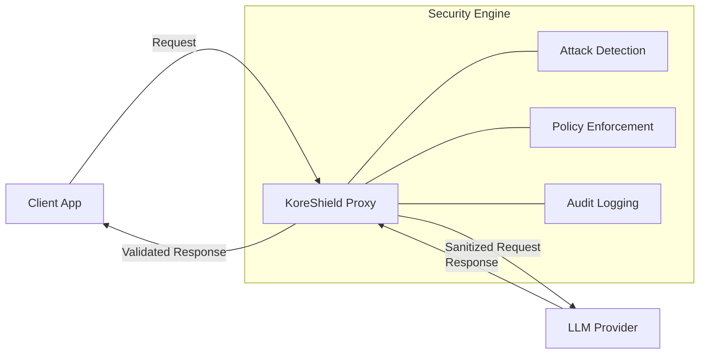

# Introduction

**KoreShield** is an enterprise-grade security middleware designed to protect GenAI applications from prompt injection, data exfiltration, and operational abuse. It functions as an intelligent firewall between your application and LLM providers (e.g., OpenAI, Anthropic, DeepSeek).

<Callout type="info">
  **Core Value**: KoreShield ensures that your LLM applications remain secure, compliant, and reliable by sanitizing inputs and validating outputs in real-time.
</Callout>

## The Security Challenge

Integrating LLMs into production environments introduces novel attack vectors that traditional WAFs cannot detect:

1.  **Prompt Injection**: Malicious actors manipulating the model's instructions to bypass safety guardrails.
2.  **Indirect Injection (RAG)**: Compromised external data (emails, documents) hijacking the model's context.
3.  **Data Leakage**: Unintentional exposure of PII (Personally Identifiable Information) or proprietary secrets.
4.  **Denial of Service**: Resource exhaustion attacks targeting expensive LLM tokens.

## How KoreShield Works

KoreShield operates as a **transparent proxy**. It intercepts API requests, performs deep security analysis, and enforces your organization's security policies before the request reaches the model provider.

## Key Capabilities

### 🛡️ Defense-in-Depth
*   **Heuristic Analysis**: Detects known attack patterns and jailbreak attempts.
*   **LLM-based Evaluation**: Uses specialized small models to identify semantic threats.
*   **RAG Security**: Scans retrieved documents for hidden instructions ("context poisoning").

### ⚡ Performance First
*   **Sub-millisecond Latency**: Optimized Go/Python engine for minimal overhead.
*   **Streaming Support**: Full support for Server-Sent Events (SSE) and token streaming.
*   **High Throughput**: Horizontally scalable architecture designed for high-volume workloads.

### 🔌 Universal Compatibility
*   **Provider Agnostic**: Unified API for OpenAI, Anthropic, DeepSeek, and local models.
*   **SDK Support**: Native clients for Python and TypeScript/JavaScript.
*   **Framework Integrations**: seamlessly integrates with LangChain, LlamaIndex, and Vercel AI SDK.

## Next Steps

*   [**Installation Guide**](/docs/getting-started/installation): Deploy your first instance in under 5 minutes.
*   [**RAG Defense**](/docs/features/rag-defense): Learn how to secure your retrieval pipelines.
*   [**API Reference**](/docs/api/rest-api): Explore the programmable security interface.
